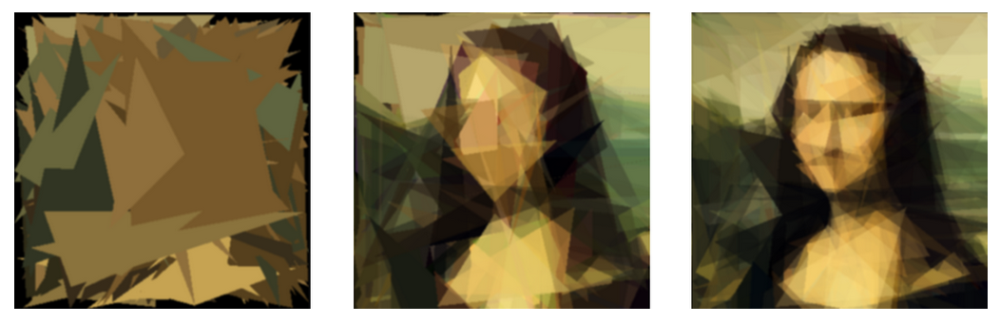

# Mutating Mona Lisa
* A hill-climbing algorithm to compress/imitate an input image with randomly generated polygons.
* A full description of this project may be found <a href="https://freddyox.github.io/blog/mona-lisa/">within my website</a>.

## Output

